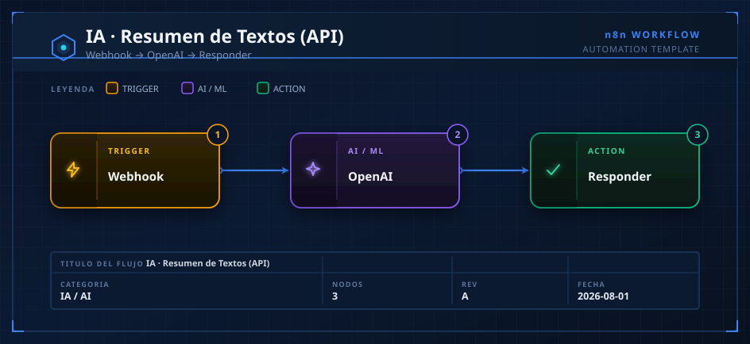
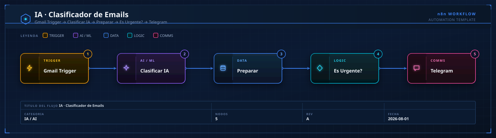
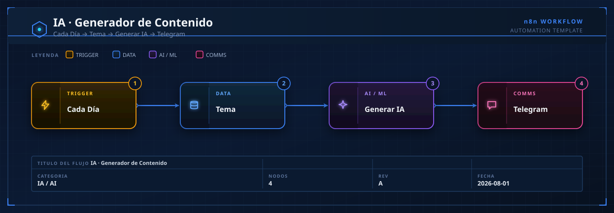
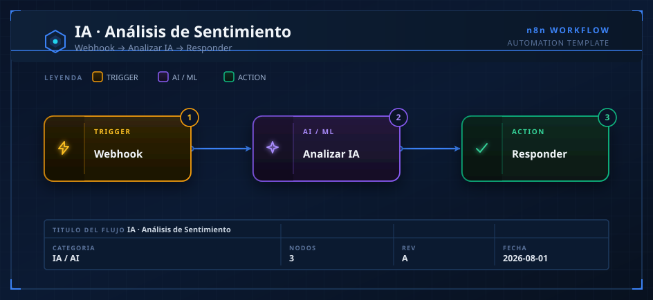
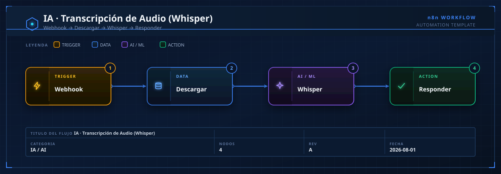

# 01 · IA / AI — Catálogo de Automatizaciones

> **Categoría oficial n8n:** *AI* (7,627 plantillas en n8n.io — la más grande de la biblioteca oficial).
> **Fuentes cruzadas:** n8n.io/workflows · GitHub `enescingoz/awesome-n8n-templates` (24.3k★) · `felipfr/awesome-n8n-workflows` · Activepieces (categorías *Artificial Intelligence* y *Universal AI*).
> **Cómo usar:** cada `.json` se importa arrastrándolo al canvas de n8n, o con `Ctrl+C` sobre el contenido del JSON y `Ctrl+V` en el canvas. El `.svg` es el diagrama visual del flujo.

---

## 1. IA-Resumen-Textos-API

- **Qué hace:** Expone un endpoint HTTP que recibe un texto y devuelve un resumen en 3 puntos clave generado por OpenAI.
- **Flujo:** `Webhook (POST /resumir)` → `HTTP Request (OpenAI Chat)` → `Respond to Webhook`.
- **Credenciales:** `openAiApi` (API key de OpenAI).
- **Casos de uso:** resumir artículos, tickets de soporte largos, hilos de correo, notas de reuniones.
- **Observaciones:**
  - Usa `gpt-4o-mini` para abaratar coste; cambia a `gpt-4o` si necesitas más calidad.
  - El webhook es **público** por defecto: añade autenticación (Header Auth) antes de exponerlo a producción.
  - `responseMode: responseNode` es obligatorio para poder devolver el JSON con `Respond to Webhook`.

## 2. IA-Clasificador-Emails

- **Qué hace:** Lee correos nuevos de Gmail, la IA los clasifica (urgente/normal/spam/newsletter) y alerta por Telegram si son urgentes.
- **Flujo:** `Gmail Trigger` → `HTTP Request (OpenAI)` → `Set` → `IF (es urgente?)` → `Telegram` / `NoOp`.
- **Credenciales:** `gmailOAuth2` + `openAiApi` + `telegramApi` (token de bot + chat_id).
- **Casos de uso:** triaje automático de bandeja de entrada, priorización de soporte, filtrado de spam.
- **Observaciones:**
  - **Reemplaza `TU_CHAT_ID`** en el nodo Telegram (obténlo con @userinfobot).
  - El trigger de Gmail usa *polling* cada minuto; en n8n self-hosted considera el modo *push* si tienes Google Cloud configurado.
  - El prompt fuerza una sola palabra de salida → fácil de comparar en el nodo `IF`. Aun así, se aplica `.trim().toLowerCase()` por robustez.

## 3. IA-Generador-Contenido-Redes

- **Qué hace:** Cada día genera un post para redes sociales sobre un tema definido y lo envía a Telegram para revisión/publicación.
- **Flujo:** `Schedule Trigger (diario)` → `Set (tema)` → `HTTP Request (OpenAI)` → `Telegram`.
- **Credenciales:** `openAiApi` + `telegramApi`.
- **Casos de uso:** calendario editorial automático, borradores diarios de contenido, ideas para community managers.
- **Observaciones:**
  - Programa la hora exacta en el nodo Schedule (por defecto corre al activar el workflow).
  - Ideal como *borrador* humano-en-el-loop: revisa en Telegram antes de publicar con un flujo de la categoría **06-Redes-Sociales**.
  - Para publicar directo, encadena con nodos de Buffer/LinkedIn/Facebook (ver Activepieces: *Buffer*, *LinkedIn*, *Facebook Pages*).

## 4. IA-Analisis-Sentimiento

- **Qué hace:** Endpoint que analiza el sentimiento de un texto y devuelve JSON estructurado `{sentimiento, score, razon}`.
- **Flujo:** `Webhook (POST /sentimiento)` → `HTTP Request (OpenAI, response_format=json_object)` → `Respond to Webhook`.
- **Credenciales:** `openAiApi`.
- **Casos de uso:** monitoreo de marca, análisis de reseñas, scoring de leads por tono, moderación.
- **Observaciones:**
  - `response_format: json_object` garantiza salida parseable (evita rupturas por markdown).
  - Combínalo con la categoría **04-Datos-Scraping** para analizar reseñas extraídas de la web.
  - Referencia: listado en n8n FAQ oficial como caso de uso AI ("sentiment analysis").

## 5. IA-Transcripcion-Audio-Whisper

- **Qué hace:** Recibe la URL de un audio, lo descarga y lo transcribe a texto con OpenAI Whisper (español).
- **Flujo:** `Webhook` → `HTTP Request (descarga audio → binario)` → `HTTP Request (Whisper multipart)` → `Respond to Webhook`.
- **Credenciales:** `openAiApi`.
- **Casos de uso:** transcribir notas de voz, podcasts, audios de WhatsApp, minutas de reuniones.
- **Observaciones:**
  - El primer `HTTP Request` debe devolver **archivo binario** (`responseFormat: file`) para alimentar el `multipart-form-data` de Whisper.
  - Límite de Whisper API: **25 MB** por archivo; para audios mayores, divide antes (nodo Code + ffmpeg).
  - `language: es` fuerza español; quítalo para detección automática multi-idioma.

---

### Notas generales de la categoría
- Todas las plantillas usan **HTTP Request** contra la API de OpenAI para máxima compatibilidad de importación. Si prefieres el nodo nativo, sustitúyelo por `OpenAI` (LangChain) — la lógica de credenciales es la misma (`openAiApi`).
- Para modelos **locales** (Ollama/LM Studio, como usas en otros proyectos), cambia la URL a `http://localhost:11434/v1/chat/completions` y elimina la autenticación.
- Modelos alternativos disponibles en n8n/Activepieces: `Groq`, `OpenRouter`, `Google Gemini`, `Anthropic`.
