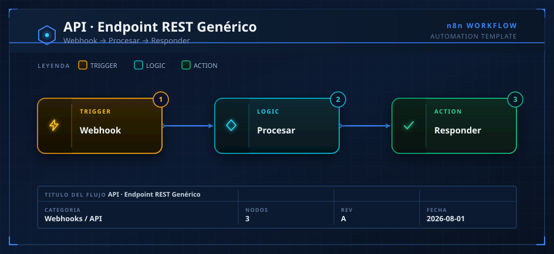
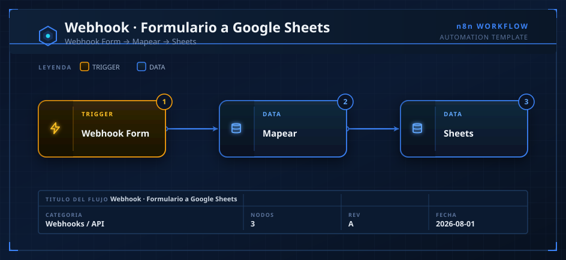
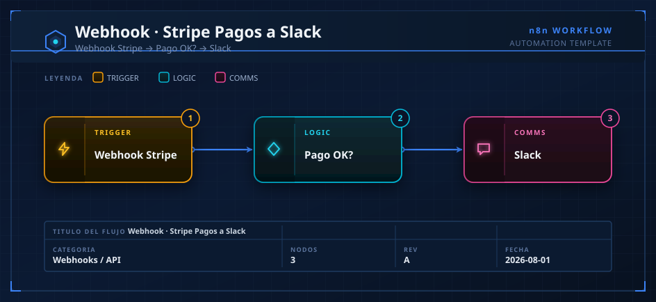

# 02 · Webhooks / API — Catálogo de Automatizaciones

> **Categoría oficial n8n:** *Other* / *IT Ops* (backend prototyping y APIs son casos de uso destacados en n8n.io).
> **Fuentes cruzadas:** n8n.io (use case *Backend prototyping / SaaS*) · GitHub `felipfr/awesome-n8n-workflows` (communication, monitoring) · Activepieces (categoría *Developer Tools*, nodos *Stripe*, *JSON*, *Webhooks*).
> **Cómo usar:** arrastra el `.json` al canvas o `Ctrl+C`/`Ctrl+V`. Obtén la URL del webhook haciendo clic en el nodo Webhook (URL de producción vs. prueba).

---

## 1. API-REST-Generica

- **Qué hace:** Convierte n8n en un microservicio REST: recibe un POST, valida/procesa con JavaScript y responde con código de estado dinámico.
- **Flujo:** `Webhook (POST /api)` → `Code (validación)` → `Respond to Webhook`.
- **Credenciales:** ninguna (opcional Header Auth para proteger).
- **Casos de uso:** prototipar backends, glue-APIs entre sistemas sin servidor, mocks, endpoints de integración rápidos.
- **Observaciones:**
  - El nodo `Code` devuelve un campo `status` que se usa como HTTP status en `Respond to Webhook` (400 si falta `nombre`).
  - Referencia oficial: n8n promueve *Backend prototyping* como use case — ideal para validar ideas sin desplegar infraestructura.
  - Para producción añade rate-limiting externo (Cloudflare/nginx) y autenticación.

## 2. Formulario-a-GoogleSheets

- **Qué hace:** Captura envíos de cualquier formulario web (HTML, Typeform, Tally) y los registra como filas en Google Sheets.
- **Flujo:** `Webhook (POST /lead)` → `Set (mapeo)` → `Google Sheets (append)`.
- **Credenciales:** `googleSheetsOAuth2`.
- **Casos de uso:** captura de leads, registros de eventos, encuestas, CRM ligero en Sheets.
- **Observaciones:**
  - **Reemplaza `TU_SPREADSHEET_ID`** y verifica el nombre de la hoja (`Leads`).
  - `mappingMode: autoMapInputData` crea columnas automáticamente según los campos del `Set`.
  - Punto de entrada típico de los flujos de **08-Marketing** (lead capture). Combina con enriquecimiento IA.

## 3. Stripe-Pagos-a-Slack

- **Qué hace:** Escucha webhooks de Stripe y notifica en Slack cada venta completada con importe y cliente.
- **Flujo:** `Webhook (POST /stripe)` → `IF (checkout.session.completed)` → `Slack`.
- **Credenciales:** `slackApi` (bot con scope `chat:write`).
- **Casos de uso:** alertas de ventas en tiempo real, dashboards de equipo, disparador de fulfilment.
- **Observaciones:**
  - Stripe envía muchos tipos de evento; el `IF` filtra solo `checkout.session.completed`.
  - `amount_total` viene en **céntimos** → se divide entre 100 para mostrar el importe real.
  - **Seguridad:** en producción valida la firma del webhook de Stripe (`Stripe-Signature`) con un nodo Code antes de procesar.
  - En n8n existe nodo nativo `Stripe Trigger` (usa la credencial `stripeApi`); este enfoque por webhook genérico es más portable.

---

### Notas generales de la categoría
- Los webhooks de n8n tienen dos URLs: **Test** (solo mientras el editor está abierto) y **Production** (con el workflow activo). Usa Production para integraciones reales.
- Para APIs que requieren respuesta síncrona siempre usa `responseMode: responseNode` + `Respond to Webhook`; si no, n8n responde 200 vacío inmediatamente.
